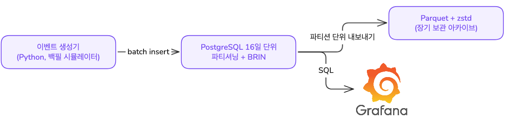
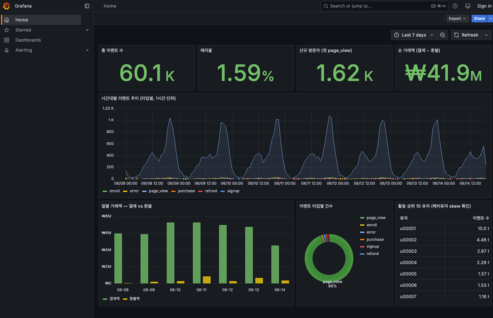
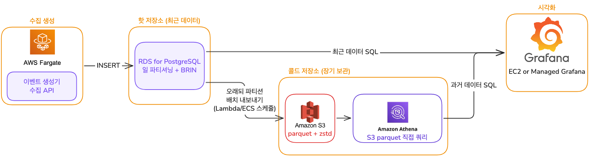

# 이벤트 로그 파이프라인

웹 서비스(라이브 강의 플랫폼을 가정)의 유저 행동 이벤트를 **생성 → 저장 → 분석 → 시각화**하는 파이프라인입니다.



## 1. 실행 방법

요구 도구: **Docker / Docker Compose** (그 외 설치 불필요)

```bash
git clone <repo-url>
cd live_class_assignment
docker compose up --build
```

한 번의 명령으로 아래가 순서대로 자동 실행됩니다.

1. **PostgreSQL** 기동 + 스키마 생성 (`db/init/01_schema.sql`)
2. **generator** 컨테이너가 실행 시점 기준 **과거 7일치 이벤트 약 6만 건**을 시뮬레이션해 일별 파티션에 적재 (1분 내외 소요)
3. 전체 파티션을 **Parquet+zstd**로 내보내고 크기 비교 리포트 생성 → 호스트의 `parquet_output/` 에 저장
4. **Grafana** 기동 (적재 완료 후에 뜨도록 `depends_on` 설정)

확인:

- **대시보드**: http://localhost:3000 — 로그인·클릭 없이 바로 데이터가 채워진 대시보드가 열립니다 (익명 조회 + 홈 대시보드 지정)
- **분석 쿼리**: `docker compose exec postgres psql -U app -d eventdb -f - < analysis/queries.sql`
- **아카이브**: `parquet_output/` 에 일별 `.parquet` 파일과 `size_report.txt` (PG vs Parquet 크기 실측)

생성량·기간은 `docker-compose.yml`의 `GEN_*` 환경변수로 조절할 수 있습니다. 시드 고정(`GEN_SEED`)으로 생성 로직이 고정되어 **규모·타입 분포·압축비가 안정적으로 재현**됩니다. 다만 event_time을 실행 시점 기준 상대 윈도우로 배정하므로, 실행 시각에 따라 당일 데이터 일부와 총 건수는 조금씩 달라질 수 있습니다 (상세는 §6 참고).

종료 및 초기화:

```bash
docker compose down -v   # -v: DB 볼륨까지 삭제 (재실행 시 새로 생성·적재)
```

## 2. 이벤트 설계 — 왜 이 6종인가

이벤트 타입은 임의로 고르지 않고, **라이브 강의 플랫폼이 크리에이터에게 실제로 보여주는 대시보드 지표(방문자 수, 가입자 수, 수강신청 수, 거래액 결제/취소)를 역산**해 그 지표를 재현할 수 있는 최소 집합으로 정했습니다. 어떤 데이터를 분석할지 먼저 정하고 그에 따른 이벤트를 설계했습니다.

| 이벤트 | 역산 근거 (대시보드 지표) | 비고 |
|---|---|---|
| `page_view` | PV, 방문자 수, 신규 방문자 | course_id nullable — 클래스 상세면 값, 홈/검색이면 NULL |
| `signup` | 가입자 수 | 신규 유저의 첫 세션에서만 발생 |
| `enroll` | 수강신청 수 | 무료 클래스가 존재하므로 **결제와 별개 이벤트** |
| `purchase` | 거래액(결제) | amount 보유 |
| `refund` | 거래액(취소) | purchase 이후에만 발생 |
| `error` | — | 에러율 모니터링 (과제 예시 + Step 3 쿼리 대상) |

### 생성기의 현실성 장치

독립적으로 랜덤 추출하면 논리적으로 모순된 로그가 생깁니다. 예를 들어 로그인하지 않은 유저가 강의를 구매하는 경우입니다. 이런 모순을 막고 현업 데이터에 가깝게 만들기 위해 5가지 장치를 넣었습니다.

1. **퍼널 선후관계** — 세션 단위 상태로 `page_view → signup → enroll → purchase → (일부) refund` 순서를 보장
2. **Skew 2축** — 유저·클래스 모두 Zipf 분포(k등 빈도 ∝ 1/k). 균등 랜덤이면 모든 유저가 비슷하게 활동하는 비현실적 데이터가 됩니다. 실제 데이터의 멱법칙(소수 헤비유저·스타 클래스 집중)을 재현
3. **시간대 피크** — 라이브 강의 도메인 특성상 저녁 19~22시 집중 (시간대별 가중 추출)
4. **에러율** — 트래픽에 비례한 ~1.5%
5. **무료/유료 분기 + 환불** — 무료 클래스는 enroll만, 유료는 enroll+purchase. 환불은 결제의 ~7%가 1~72시간 뒤 발생. **전액 환불만 구현** — 부분 환불·환불 사유는 이 과제 스코프에서 의도적으로 제외했습니다

### 생성 시각: 백필 시뮬레이터

생성기는 현재 발생하는 이벤트를 기록하는 게 아니라 **과거 7일치 데이터를 만들어내는 시뮬레이터**입니다. 
두 가지 이유 때문입니다. 
첫째, 현재 시각만 찍으면 모든 데이터가 당일 파티션 하나에 몰려 일 단위 파티셔닝과 7일 추이 차트가 의미를 잃습니다. 
둘째, 과제 기간이 3일이라 실시간 수집만으로는 분석할 데이터가 부족합니다. 그래서 실행 시점 기준 `[now−7d, now]` **상대 윈도우**에 event_time을 배정했고, 평가자가 언제 `docker compose up`을 해도 Grafana 기본 시간창(최근 7일)에 데이터가 채워집니다.

생성 후 **event_time 정렬 → 적재**로 실서비스의 시간순 도착을 재현합니다. 물리 저장 순서와 event_time의 상관관계가 아래 BRIN 인덱스의 전제이기 때문입니다.

## 3. 스키마 설명 (저장 구조)

```
courses (course_id PK, title, category, price, discount_price, is_free)   -- 차원
events  (event_id, event_type, event_time, user_id, session_id,
         course_id NULL, amount NULL, error_code NULL)                     -- 팩트
        PARTITION BY RANGE (event_time)  -- 일 단위
```

- **단일 와이드 팩트 테이블 + 차원 1개**: 분석 쿼리(타입별 카운트, 시간대 추이, 유저별 합계)가 전부 이벤트 타입을 **가로지르기** 때문에, 타입별 테이블 분리 대신 한 테이블에 두고 `GROUP BY event_type` 한 줄로 끝나게 했습니다. 분석 쿼리의 읽기 패턴에 맞춰 테이블 구조를 정했습니다.
- **타입 전용 컬럼은 nullable**: `amount`는 purchase/refund만, `error_code`는 error만 값을 가집니다. PG는 행마다 컬럼당 1비트 null bitmap만 쓰고 NULL 값은 공간을 차지하지 않으므로, 와이드 테이블이라도 NULL로 인한 공간 부담은 거의 없습니다.
- **일 단위 RANGE 파티셔닝**: 모든 분석 쿼리가 시간 범위 기반 → 파티션 프루닝으로 범위 밖 일자는 열어보지도 않습니다. 추가 효용은 수명 관리 — 오래된 파티션을 통째로 Parquet으로 내보내고 정리할 수 있습니다.

### 인덱스: 쿼리 축 2개에 인덱스 2개

| 쿼리 축 | 인덱스 | 이유 |
|---|---|---|
| 시간 범위 집계 | `BRIN(event_time)` | 시간순 append-only 적재라 물리 순서↔값 상관관계가 성립. 블록 묶음별 min/max 요약만 저장해 B-tree 대비 수백 배 작음 |
| 유저 단위 시퀀스 | `B-tree(user_id, event_time)` | 한 유저의 이벤트는 시간축 전체에 흩어져 BRIN 전제가 무너짐. 복합 키 순서 덕에 유저를 찾으면 이벤트가 이미 시간순 — 퍼널/세션 분석에 맞는 형태 |
| 타입별 필터 | **없음 (의도)** | 카디널리티 6이라 인덱스 선택도가 없음. 파티션 프루닝 + 스캔으로 충분 |

PK도 의도적으로 걸지 않았습니다. append-only 로그에 point lookup이 없고, 파티션 테이블의 PK는 `(event_id, event_time)` 복합이 강제되는데 그 거대한 B-tree를 쓰는 쿼리가 하나도 없기 때문입니다.

### 저장소 선택 이유 — 왜 PostgreSQL인가

판단 기준은 이 데이터의 특성 4가지입니다: ① append-only(수정·삭제 없음) ② 시간순 도착 ③ 읽기 패턴이 집계 중심(전부 GROUP BY) ④ skewed(유저 멱법칙, 시간대 피크).

| 후보                     | 판단                                                                     |
| ---------------------- | ---------------------------------------------------------------------- |
| **PostgreSQL**         | **채택** — BRIN + 네이티브 파티셔닝이 append-only 시계열의 물리 특성에 정확히 부합. BI 도구 1급 지원 |
| MySQL                  | 가능하지만 채택 근거가 익숙함 정도뿐. 시계열 물리 설계 수단(BRIN 등)이 PG보다 빈약                     |
| DuckDB                 | 집계 성능은 가장 좋지만 임베디드라 앱·DB를 별도 컨테이너로 나누는 구성과 맞지 않고 BI 연결·동시 쓰기에 제약              |
| SQLite                 | 파티셔닝·동시성·스케일 서사 부재                                                     |
| MongoDB                | 과제의 JSON 통째 저장 금지 요건과 문서 모델이 맞지 않음                                   |
| ClickHouse/TimescaleDB | 시계열 특화 저장소는 현 스케일에서 운영 복잡도가 더 큼 — 100배 스케일 시나리오로 후술                    |

집계 중심 워크로드는 기술적으로 **컬럼 저장**이 유리합니다. PG는 row store라 이 이점이 없는데, 그 한계를 장기 보관 레이어에서 보완하는 것이 아래 Parquet 트랙입니다.

### Parquet + zstd 아카이브 (장기 보관 레이어)

적재 후 일별 파티션을 `parquet_output/`에 Parquet+zstd로 내보냅니다. 이 데이터는 컬럼 저장에 특히 유리한 구조입니다.

- `amount` ~95% NULL, `error_code` ~98% NULL → 컬럼별 연속 저장이라 NULL 런이 **RLE**(run-length encoding)로 몇 바이트가 됨
- `event_type` 카디널리티 6, Zipf로 반복되는 헤비유저·스타 클래스 ID → **dictionary encoding** 효율 극대화
- 그 위에 zstd (압축률/속도 균형)

이론에 그치지 않도록 실제 크기를 측정했습니다. 같은 데이터의 PG 파티션 크기(인덱스 포함)와 Parquet 파일 크기를 비교한 결과가 `parquet_output/size_report.txt`로 자동 생성됩니다 (수치는 아래 고민한 점에 정리).

## 4. 분석 쿼리 

`analysis/queries.sql`에 7개: 과제 예시 4개(타입별 카운트 / 유저별 상위 / 시간대 추이 / 에러율) + 도메인 쿼리 3개(일별 거래액 결제vs환불 / 일별 신규 방문자 / 매출 상위 클래스 — 팩트·차원 조인). 전부 Grafana 패널과 대응합니다.

## 5. 시각화 

**Grafana + 파일 기반 프로비저닝**. datasource YAML과 대시보드 JSON을 repo에 커밋해 두어, 컨테이너 기동만으로 PG 연결과 대시보드가 자동 구성됩니다. 익명 조회와 홈 대시보드를 지정해 두어 `docker compose up` 후 localhost:3000을 열면 별도 설정 없이 데이터가 채워진 대시보드가 바로 보입니다.

비즈니스 지표 성격상 Metabase도 적합하지만, 초기 설정이 UI 클릭에 의존해 자동화하려면 비공식 API 스크립트가 필요합니다. 파일 프로비저닝이 공식 기능이라 재현성이 보장되는 Grafana를 선택했습니다. 한 번의 실행으로 시각화까지 자동으로 구성되도록 하기 위해서입니다.



위쪽 네 개 패널은 총 이벤트 수·에러율·신규 방문자·순 거래액(결제−환불)이고, 그 아래로 시간대별 이벤트 추이, 일별 거래액(결제 vs 환불), 이벤트 타입별 비중, 활동 상위 유저(헤비유저 skew)를 배치했습니다. 각 패널은 `analysis/queries.sql`의 쿼리와 대응합니다.

## 6. 구현하면서 고민한 점

### ① 생성 시각 — 전부 오늘 파티션에 몰리는 문제

처음 설계에서 가장 먼저 잡은 문제입니다. 생성기가 현재 시각을 찍으면 일 단위 파티셔닝·7일 추이·아카이브 시연이 전부 무의미해집니다. 생성기를 현재 시각 기록기가 아니라 과거 N일치 데이터를 만드는 시뮬레이터로 보고, 절대 날짜가 아닌 **상대 윈도우**(실행 시점 기준 과거 7일)로 구현해 평가 시점과 무관하게 재현되도록 했습니다.

### ② properties JSONB 컬럼 — 알지만 배제

타입별 가변 필드를 JSONB 하나에 넣는 설계는 실무에서 흔하고(스키마 변경 없이 타입 추가) 고려했지만 배제했습니다. ① 과제의 JSON 통째 저장 금지 요건과 애매하게 걸치고, 효율적 저장을 고민하라는 출제 의도에 더 맞는 쪽을 택했습니다. ② JSON 내부 값(amount)을 집계하려면 매번 파싱이 필요하고 컬럼 통계·인덱스를 활용하기 어렵습니다.

### ③ Skew를 어디서 만들고 어떻게 해소하는가

- **생성**: 일부러 만든다 (Zipf 2축 + 시간대 피크) — 현실 데이터의 특성이므로
- **저장**: 컬럼 저장에서는 오히려 호재 — 반복 값일수록 dictionary encoding 효율 상승 (Parquet 트랙의 근거)
- **파티션**: 파티션 키가 user_id가 아닌 **시간**이라 엔티티 skew가 파티션 skew로 전이되지 않습니다 (user_id 해시 파티셔닝이었다면 핫 파티션 발생). 시간대 피크는 **일 단위** 파티션이 하루 안에서 흡수합니다 — hour 단위였으면 저녁 파티션만 비대해졌을 것이므로, 일 단위로 나눈 근거이기도 합니다
- 헤비유저 조회는 B-tree가 정상 처리하고, skew가 진짜 문제가 되는 건 분산 처리 스케일(핫 파티션·스트래글러)입니다 — 아래 스케일 시나리오 참고

### ④ 트래픽 100배라면

현재 구조에서 바뀌는 지점을 미리 그려봤습니다.

- **수집**: 생성기 → DB 직접 INSERT가 병목 → 앞단에 Kinesis 같은 스트리밍 버퍼를 두고 마이크로배치 적재
- **저장**: row store 집계의 한계 도달 → 핫 데이터는 ClickHouse 같은 컬럼 저장 DB로, PG는 트랜잭션 데이터로 역할 분리. 콜드 데이터는 이미 구현한 Parquet 아카이브 경로 그대로 (S3 + Athena, 아래 구성도)
- **skew**: 분산 처리 시 파티션 키 설계가 본질이 됨 — 시간+해시 복합 키 등

### ⑤ 실측: PG vs Parquet 크기

컬럼 저장이 유리하다는 점을 이론으로만 두지 않고 같은 데이터로 직접 측정했습니다 (실행 시 `parquet_output/size_report.txt`로 자동 생성). 아래는 한 실행(7일치 약 6.2만 건) 기준 수치이며, 생성 데이터 규모가 실행마다 조금씩 달라도 **압축비는 4.8~4.9x로 안정적으로 재현**됩니다.

| | PG 파티션 합계 (인덱스 포함) | Parquet+zstd 합계 | 비율 |
|---|---|---|---|
| 7일치 약 6.2만 건 | 9.5 MB | 2.0 MB | **4.8x** |

구조적 희소성(`amount` ~95% NULL → RLE)과 저카디널리티(`event_type` 6종, Zipf 반복 ID → dictionary encoding)가 컬럼 저장 압축에 유리하다는 가설의 실측 증거입니다. 행 수가 커질수록(블록당 고정 오버헤드 희석, 사전 재사용) 격차는 더 벌어집니다.

### ⑥ 재현성의 범위 — 시드를 고정해도 데이터가 완전히 같지는 않다

`docker compose down -v` 후 두 번 클린 실행해 일자별 건수를 비교하니, 시드(`GEN_SEED=42`)가 같은데도 과거 날짜까지 건수가 수~수십 건씩 달랐습니다(예: 06-09 9,245 → 9,266). 처음엔 당일 파티션의 변화로만 봤는데 실제로는 전 구간이 달라져, 원인을 추적했습니다.

원인은 ①의 상대 윈도우 설계와 난수 소비의 상호작용입니다. `random_session_start()`가 만든 세션 시각이 실행 시점(`now`)의 미래면 그 세션을 스킵하는데, 스킵된 세션은 뒤따르는 난수(유저 추출·세션 내용)를 소비하지 않습니다. 실행 시각에 따라 스킵되는 세션 집합이 달라지므로 **난수 시퀀스 전체가 어긋나(desync)** 첫 스킵 이후의 모든 데이터가 달라집니다. 시드는 같아도 `now`가 시퀀스를 흔드는 구조입니다.

그래서 이 프로젝트의 재현성은 **"규모·타입 분포·압축비가 안정적으로 재현"되는 통계적 재현성**이지, 바이트 단위 동일은 아닙니다. 실제로 두 실행 모두 일자별 ~9,100건, 총 ~6.2만 건, 압축비 4.8x로 일관됐습니다. 분석·시각화 목적에는 이 수준으로 충분하다고 판단해 현재 설계를 유지했습니다.

완전한 결정성이 필요하다면, `now` 의존 스킵을 생성 단계에서 제거하고 전부 생성한 뒤 마지막에 `event_time > now`만 필터로 잘라내면 됩니다. 그러면 난수 시퀀스가 `now`와 무관해져 과거 일자는 매 실행 동일하고 당일 데이터만 잘린 만큼 달라집니다.

## 7. 선택 과제 B — AWS 아키텍처 구성도

이 파이프라인을 AWS에 올린다면, 로컬 구성 요소가 그대로 매핑됩니다.



### 서비스 역할과 선택 이유

- **ECS Fargate** — 이벤트 생성기(수집 워커) 실행. 서버 관리 없이 컨테이너만 배포하면 되고, 이 워크로드는 상태가 없어 Fargate의 단순함이 EC2 직접 운영보다 맞습니다.
- **RDS for PostgreSQL** — 로컬의 PG 컨테이너 역할 그대로의 **핫 저장소**. 최근 N일의 데이터를 파티셔닝+BRIN 구조로 보관하고 대시보드의 실시간 쿼리를 받습니다. 백업·패치·복제를 직접 운영하지 않으려고 관리형을 선택했습니다.
- **S3** — Parquet 아카이브의 목적지인 **콜드 저장소**. 저장 단가가 DB 스토리지보다 훨씬 낮고 내구성이 높아 오래된 파티션을 내보내는 경로의 종착지로 자연스럽습니다. 내보내기는 Lambda 또는 ECS 스케줄 태스크로 일 1회 배치.
- **Athena** — S3의 Parquet을 **이동 없이 직접 쿼리**. 별도 클러스터를 상시로 띄우지 않고 쿼리당 과금이라, 가끔 조회하는 과거 데이터라는 접근 패턴에 비용 구조가 맞습니다. 컬럼 저장(Parquet)의 집계 이점을 그대로 활용합니다.
- **Grafana** — 핫(RDS)과 콜드(Athena)를 데이터소스 2개로 한 대시보드에서 조회.

대안 비교: 상시 대량 분석이라면 Athena 대신 **Redshift**가 맞지만, 클러스터 상시 비용이 들어 현재 접근 패턴(가끔 보는 콜드 데이터)에는 과합니다. DB도 트래픽이 커지면 **Aurora**로 읽기 복제·스토리지 확장을 얻을 수 있으나, 시작점에서는 RDS로 충분합니다.

### 가장 고민한 부분 — Kinesis를 넣을 것인가

수집 계층(생성기 → DB) 사이에 Kinesis 같은 스트리밍 버퍼를 둘지 가장 오래 고민했습니다. 장점은 명확합니다 — DB 장애 시 이벤트 유실 방지(버퍼링), 쓰기 피크 흡수, 컨슈머 확장. 그러나 현재 스케일(일 수만 건)에서는 RDS 직접 INSERT로 충분하고, Kinesis는 샤드 관리·컨슈머 운영이라는 새 복잡도를 가져옵니다. 지금 당장 필요하지 않은 기능 때문에 복잡도를 늘리지 않는다는 기준으로 배제하되, 트래픽 100배 시점에 수집 계층만 교체하면 되도록 생성기-저장소 사이를 단일 진입점으로 유지했습니다. 구성도에서 Kinesis가 들어갈 자리는 ECS와 RDS 사이입니다.

## 프로젝트 구조

```
├── docker-compose.yml          # 전체 스택 (postgres + generator + grafana)
├── db/init/01_schema.sql       # 스키마: 파티셔닝·인덱스 (설계 의도 주석 포함)
├── generator/                  # 이벤트 생성·적재·아카이브 (Python)
│   ├── main.py                 #   진입점: 생성 → 적재 → Parquet 내보내기
│   ├── simulate.py             #   백필 시뮬레이터 (퍼널·Zipf·시간대 피크)
│   ├── db.py                   #   파티션 생성·배치 적재
│   └── export_parquet.py       #   Parquet+zstd 내보내기 + 크기 비교 리포트
├── analysis/queries.sql        # Step 3 집계 쿼리 7개
└── grafana/                    # 프로비저닝 (datasource + 대시보드 JSON)
```
